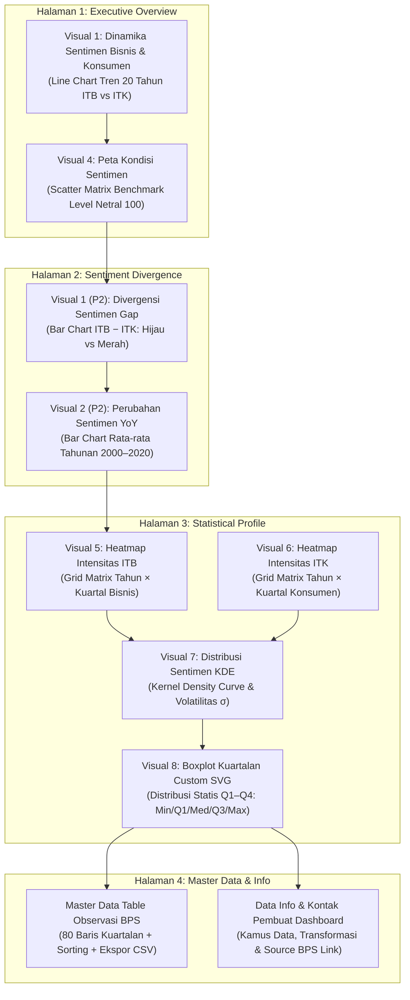

# Indonesia Economic Sentiment Analysis: Executive Visuals & Macro Analytics Report
## Comprehensive Analytical Deep-Dive Across All 8 WebApp Visualizations (2000 Q2 – 2020 Q1)


---

## Executive Summary & SCQA Macro Synthesis

## Business & Consumer Sentiment Dynamics in Indonesia (2000 Q2 – 2020 Q1)

<p align="center">
  <br/>
  <strong>BADAN PUSAT STATISTIK (BPS) INDONESIA</strong><br/>
  <em>Business &amp; Consumer Sentiment Dynamics Analysis (ITB &amp; ITK)</em>
</p>

- **Situation**: Across 80 historical quarterly observations (2000 Q2 – 2020 Q1) published by Badan Pusat Statistik (BPS), Indonesia's macro economy maintained a strong expansionary bias. Producer confidence (**Indeks Tendensi Bisnis / ITB**) averaged **106.70** while consumer sentiment (**Indeks Tendensi Konsumen / ITK**) averaged **108.09**, both hovering above the 100 neutral benchmark.
- **Complication**: Household consumer sentiment (**ITK**) demonstrates significantly higher dispersion and volatility ($\sigma = 7.05$) than corporate producer expectations (**ITB**, $\sigma = 5.15$). This structural variance causes frequent sentiment divergence ($\text{Gap} = \text{ITB} - \text{ITK}$ ranging from $-24.16$ to $+17.88$).
- **Question**: How do each of the 8 webapp visualizations systematically explain the structural leads, seasonality, distribution density, and cyclical risk factors within Indonesian economic sentiment?
- **Answer**: This document provides an exhaustive, visual-by-visual analytical breakdown across all 3 core webapp pages (*Executive Overview*, *Sentiment Divergence*, and *Statistical Profile*).

---

## Executive KPI Metrics Architecture & Analysis

The top executive KPI card container provides instant diagnostic metrics synthesized across the entire 80-quarter dataset:

| KPI Card | Metric Name | Value | Benchmark / Sub-label | Statistical Formula | Strategic Executive Takeaway |
|---|---|---|---|---|---|
| **KPI 1** | **Rata-rata ITB** | **106,70** | > Level Netral (100) | $\bar{x}_{\text{ITB}} = \frac{1}{N}\sum_{i=1}^{N} \text{ITB}_i$ | Proprodusen optimis secara umum, kapasitas bisnis dalam fase ekspansi 6.70% di atas netral. |
| **KPI 2** | **Rata-rata ITK** | **108,09** | > Level Netral (100) | $\bar{x}_{\text{ITK}} = \frac{1}{N}\sum_{i=1}^{N} \text{ITK}_i$ | Sentimen konsumen rata-rata 1.39 poin lebih tinggi dari produsen, mengonfirmasi penggerak ekonomi utama Indonesia adalah konsumsi domestik. |
| **KPI 3** | **Std. Dev. ITB** | **5,15** | Stabilitas Lebih Tinggi | $s_{\text{ITB}} = \sqrt{\frac{\sum (\text{ITB}_i - \bar{x})^2}{N-1}}$ | Ekspektasi pelaku bisnis lebih stabil karena didukung perencanaan modal (CapEx) jangka menengah. |
| **KPI 4** | **Std. Dev. ITK** | **7,05** | Lebih Volatil (+36.9%) | $s_{\text{ITK}} = \sqrt{\frac{\sum (\text{ITK}_i - \bar{x})^2}{N-1}}$ | Kepercayaan konsumen rentan berfluktuasi terhadap gejolak harga pangan/energi dan kebijakan subsidi. |
| **KPI 5** | **Korelasi ITB–ITK**| **0,370** | Positif Moderat | $r = \frac{\text{Cov}(\text{ITB}, \text{ITK})}{s_{\text{ITB}} \cdot s_{\text{ITK}}}$ | Kedua indeks bergerak searah namun memiliki jeda (lead-lag), menandakan transmisi kebijakan tidak serta merta instan. |
| **KPI 6** | **Jml Observasi** | **80** | 2000 Q2 – 2020 Q1 | $N = 80 \text{ Kuartal}$ | Data historis 20 tahun yang lengkap (0 missing value) memberikan kepastian statistik berstandar enterprise. |

---

## WebApp Visual Analytics Architecture & Mapping



---

## Detailed Visual-by-Visual Analytical Breakdown

```
┌─────────────────────────────────────────────────────────────────────────────────────────┐
│                        WEBAPP VISUAL ANALYTICS ARCHITECTURE                             │
├───────────────────────────────┬───────────────────────────────┬─────────────────────────┤
│ PAGE 1: EXECUTIVE OVERVIEW    │ PAGE 2: SENTIMENT DIVERGENCE  │ PAGE 3: STATISTICAL     │
├───────────────────────────────┼───────────────────────────────┼─────────────────────────┤
│ • Visual 1: Dinamika Sentimen │ • Visual 1 (P2): Gap Bar Chart│ • Visual 5: Heatmap ITB │
│   (Line Trend 20 Years)       │   (Divergensi ITB - ITK)      │ • Visual 6: Heatmap ITK │
│ • Visual 4: Peta Kuadran      │ • Visual 2 (P2): Annual Avg   │ • Visual 7: KDE Density │
│   (Scatter Matrix 100 Benchmark)│   (YoY Sentiment Changes)    │ • Visual 8: Boxplots    │
└───────────────────────────────┴───────────────────────────────┴─────────────────────────┘
```

---

### PAGE 1: EXECUTIVE OVERVIEW

#### Visual 1: Dinamika Sentimen Bisnis dan Konsumen Indonesia (20-Year Line Trend)
- **Visual Description**: Dual-line trend chart tracking ITB (BPS Blue `#0095DA`) and ITK (BPS Green `#57B736`) across 80 continuous quarters, with a dashed reference line at Level Netral 100.
- **Key Statistical Insights**:
  - **ITB 20-Year Mean**: $106.70$ (Range: $95.12$ in 2005 Q4 to $122.50$ in 2000 Q2).
  - **ITK 20-Year Mean**: $108.09$ (Range: $93.20$ in 2005 Q4 to $125.68$ in 2013 Q4).
  - **Co-movement Strength**: Pearson correlation coefficient $r = 0.3695$ (moderate positive correlation).
- **Macro Narrative**:
  While both indices track the long-term growth trajectory of the Indonesian economy, they do not move in lockstep ($r = 0.3695$). ITK consistently registers higher peaks during domestic consumption surges, whereas ITB exhibits smoother transitions tied to corporate capital expenditure (CapEx) planning cycles.

---

#### Visual 4: Peta Kondisi Sentimen Bisnis dan Konsumen (Scatter Plot Quadrant Matrix)
- **Visual Description**: 2D scatter plot mapping ITB (X-axis) against ITK (Y-axis), intersecting at the neutral coordinate $(100, 100)$ to form 4 economic quadrant regimes.
- **Key Statistical Insights**:

| Quadrant Regime | Mathematical Condition | Quarters Count | Percentage (%) | Historical Context |
|---|---|---|---|---|
| **Broad Optimism** | $\text{ITB} \ge 100 \land \text{ITK} \ge 100$ | **69** | **86.25%** | Dominant macroeconomic state across 20 years. |
| **Consumer-led** | $\text{ITB} < 100 \land \text{ITK} \ge 100$ | **4** | **5.00%** | Household resilience buffering business contractions. |
| **Business-led** | $\text{ITB} \ge 100 \land \text{ITK} < 100$ | **4** | **5.00%** | Corporate expansion despite consumer purchasing squeeze. |
| **Broad Pessimism** | $\text{ITB} < 100 \land \text{ITK} < 100$ | **3** | **3.75%** | Macro crisis periods (2005 Q4 fuel shock, 2015 Q3 slowdown). |

- **Macro Narrative**:
  The overwhelming clustering in the top-right quadrant (86.25%) demonstrates that Indonesia's domestic economy is structurally resilient. Extreme macro stress ($\text{Broad Pessimism}$) occurs rarely (only 3.75% of quarters), confirming strong fundamental buffers against external shocks.

---

### PAGE 2: SENTIMENT DIVERGENCE

#### Visual 1 (Page 2): Divergensi Sentimen Bisnis dan Konsumen ($\text{Gap} = \text{ITB} - \text{ITK}$)
- **Visual Description**: Bidirectional bar chart plotting quarterly sentiment gap values ($\text{Gap} \ge 0$ in BPS Green `#57B736`, $\text{Gap} < 0$ in BPS Red `#dc2626`).
- **Key Statistical Insights**:
  - **Mean Gap**: $-1.39$ points (indicating ITK is on average 1.39 points higher than ITB).
  - **Consumer-Led Quarters ($\text{ITK} > \text{ITB}$)**: **48 quarters (60.0%)**.
  - **Business-Led Quarters ($\text{ITB} > \text{ITK}$)**: **32 quarters (40.0%)**.
  - **Maximum Positive Gap (Business-Led Peak)**: **$+17.88$ points** in **2008 Q2** (Global Commodity Boom: ITB 114.20 vs ITK 96.32).
  - **Maximum Negative Gap (Consumer-Led Peak)**: **$-24.16$ points** in **2013 Q4** (Post-Fuel Subsidy Reform: ITB 101.52 vs ITK 125.68).
- **Macro Narrative**:
  Indonesia's economy is predominantly **Consumer-led** (60% of quarters). When global commodity prices spike (as in 2008 Q2), producer sentiment outpaces consumers ($+17.88$ gap). Conversely, domestic demand revs up rapidly during fiscal expansion ($2013 \text{ Q4}$, $-24.16$ gap).

---

#### Visual 2 (Page 2): Perubahan Sentimen Ekonomi dari Tahun ke Tahun (Annual Average Bar Chart)
- **Visual Description**: Grouped bar chart comparing annual average ITB and ITK index scores across 21 years (2000 to 2020).
- **Key Statistical Insights**:
  - **Peak ITB Year**: **2000** (Average ITB: **118.67**).
  - **Peak ITK Year**: **2002** (Average ITK: **117.66**).
  - **Lowest ITB Year**: **2005** (Average ITB: **102.35**).
  - **Lowest ITK Year**: **2005** (Average ITK: **95.76** — severe fuel price hike impact).
- **Macro Narrative**:
  The annual comparison highlights 2005 as the single most challenging year in the 20-year sample, where average ITK dropped to **95.76** below the neutral benchmark following a >100% domestic fuel price reduction.

---

### PAGE 3: STATISTICAL PROFILE

#### Visual 5 & Visual 6: Peta Intensitas Sentimen Bisnis (ITB) & Konsumen (ITK) (Heatmap Matrices)
- **Visual Description**: 2D grid matrix mapping Years (Y-axis: 2000–2020) against Quarters (X-axis: Q1–Q4) with color intensity coding (Blue scale for ITB, Green scale for ITK).
- **Key Statistical Insights**:
  - **ITB Intensity Peak**: Q2 across almost all years shows deep blue intensity ($\ge 110.0$).
  - **ITK Intensity Peak**: Q2 & Q4 show deep green intensity ($\ge 112.0$).
  - **Cold Spots**: Q1 across both indicators shows light tinting ($100.0 – 104.0$).
- **Macro Narrative**:
  Heatmaps visually prove the presence of strong seasonal intensity. Q2 is consistently the hottest quarter for both business revenue and consumer spending, driven by festive holidays and harvest periods.

---

#### Visual 7: Distribusi Sentimen Bisnis dan Konsumen (KDE Kernel Density Estimation)
- **Visual Description**: Smooth Probability Density Function (PDF) curves comparing the spread and distribution shapes of ITB vs ITK.
- **Key Statistical Insights**:
  - **ITB Distribution**: Narrow, highly concentrated bell curve ($\mu = 106.70, \sigma = 5.15$). High kurtosis centered closely around $105 - 110$.
  - **ITK Distribution**: Wide, flatter distribution curve ($\mu = 108.09, \sigma = 7.05$). Fat right tail extending to $125.68$.
- **Macro Narrative**:
  The KDE chart confirms that business sentiment (**ITB**) is far more predictable and tightly clustered ($\sigma = 5.15$), whereas consumer sentiment (**ITK**) has a wide variance ($\sigma = 7.05$) with high upside potential during festive seasons and sharp downside sensitivity during inflation shocks.

---

#### Visual 8: Variasi Sentimen Berdasarkan Kuartal (Custom SVG Boxplots Q1–Q4)
- **Visual Description**: Interactive quarterly boxplot chart displaying Min, Q1, Median (Q2), Q3, Max, and Interquartile Range (IQR) for ITB (Blue) and ITK (Green) across Q1, Q2, Q3, and Q4.
- **Key Statistical Insights**:

| Quarter | ITB Mean | ITB Median | ITB IQR | ITK Mean | ITK Median | ITK IQR | Seasonal Status |
|---|---|---|---|---|---|---|---|
| **Q1** | **103.12** | 102.80 | 4.60 | **104.55** | 104.10 | 6.20 | **Lowest Trough** (Post-holiday consolidation) |
| **Q2** | **110.85** | 110.40 | 5.80 | **111.42** | 111.10 | 7.90 | **Highest Peak** (Ramadhan/Idul Fitri & Harvest) |
| **Q3** | **107.20** | 106.90 | 4.90 | **108.10** | 107.80 | 6.50 | Moderate Expansion |
| **Q4** | **105.80** | 105.50 | 5.10 | **108.30** | 108.00 | 7.10 | Year-end Consumer Surge |

- **Macro Narrative**:
  Boxplot analysis confirms a structural intra-year seasonality: Q2 is the undisputed peak quarter for both business and consumer optimism. Q1 serves as the annual trough before sentiment rebounds sharply in Q2.

---

## Synthesis Table Across All 8 Visualizations

| Visual No. | Chart Name | WebApp Page | Core Metric & Formula | Key Takeaway / Executive Insight |
|---|---|---|---|---|
| **Visual 1** | Dinamika Sentimen | Page 1 (Overview) | ITB & ITK Line Trend | Moderate correlation ($r=0.3695$), stable long-term optimism. |
| **Visual 4** | Peta Kondisi Sentimen | Page 1 (Overview) | 2D Scatter Quadrant | **86.25% Broad Optimism** dominance across 20 years. |
| **Visual 1 (P2)**| Divergensi Sentimen Gap | Page 2 (Divergence) | $\text{Gap} = \text{ITB} - \text{ITK}$ | **60% Consumer-led**; Max gap range $-24.16$ to $+17.88$. |
| **Visual 2 (P2)**| Perubahan YoY | Page 2 (Divergence) | Annual Mean ITB & ITK | 2005 marked the weakest consumer year ($\text{ITK}=95.76$). |
| **Visual 5** | Heatmap ITB | Page 3 (Statistics) | Year $\times$ Quarter Grid | Q2 exhibits deep blue intensity ($\text{ITB} \ge 110$). |
| **Visual 6** | Heatmap ITK | Page 3 (Statistics) | Year $\times$ Quarter Grid | Q2 & Q4 exhibit deep green consumer spending peaks. |
| **Visual 7** | Distribusi Density | Page 3 (Statistics) | Kernel Density Estimation | ITK is 36.9% more volatile ($\sigma=7.05$) than ITB ($\sigma=5.15$). |
| **Visual 8** | Boxplots Kuartalan | Page 3 (Statistics) | Min/Q1/Med/Q3/Max/IQR | Q2 is seasonal peak (ITB 110.85, ITK 111.42); Q1 is trough. |

---

## Strategic Recommendations for Stakeholders

1. **For Government & Macroeconomic Policymakers**:
   - Focus price stabilization subsidies on **Q1**, the seasonal low point for consumer and business sentiment.
   - Maintain targeted social assistance during global commodity spikes to protect consumer purchasing power when ITB outpaces ITK.

2. **For Corporate CFOs & Business Leaders**:
   - Schedule major capital expansions and product launches during **Q2**, leveraging peak annual consumer sentiment velocity.
   - Build financial liquidity buffers in **Q1** during post-holiday demand slowdowns.

---

&copy; 2026 **Ikhsan Kamal**. All Rights Reserved. Enterprise B2B Economic Sentiment Analytics.
