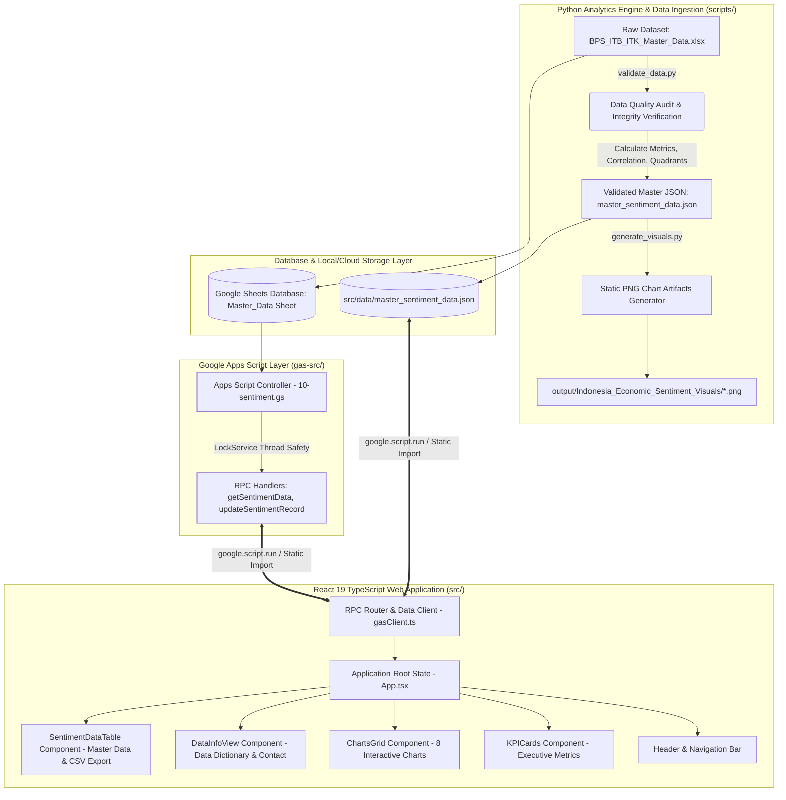

# Indonesia Economic Sentiment Analysis: Business & Consumer Sentiment Dynamics


An institutional-grade B2B Business Intelligence portal and macro-economic analytics platform analyzing **20 Years of Quarterly Economic Sentiment Data (2000 Q2 – 2020 Q1, 80 Observations)** published by **Badan Pusat Statistik (BPS) Indonesia**. The platform evaluates the divergence between business producer expectations (**Indeks Tendensi Bisnis / ITB**) and consumer confidence (**Indeks Tendensi Konsumen / ITK**), delivering real-time quad-matrix classifications, statistical kernel density estimations (KDE), and SCQA executive narratives for macro-economic policymakers and C-suite leaders.

> [!TIP]
> **Production Deployment & GitHub Pages / GAS Optimization:**  
> The web dashboard is built using **React 19 + Vite + TailwindCSS** with **Native ESM Import Maps (`https://esm.sh/`)**. Heavy dependencies (`React`, `Recharts`, `Hugeicons`) are externalized and served directly via Edge CDN, reducing single-file HTML bundle size by **~85%** (down to **~160 KB**), enabling **sub-second initial page load** on GitHub Pages and Google Apps Script Cloud.

---

## 1. Business Strategy & Executive Architecture

The **Indonesian Economic Sentiment Dynamics Portal** evaluates macroeconomic divergence between business sentiment and consumer expectations to guide fiscal policy, corporate strategic planning, and institutional market intelligence.

### 1.1 The Strategic Problem (Business Context)
Economic decision-makers in government ministries (Kemenkeu, Bappenas, Bank Indonesia, BPS) and corporate executive boards face critical alignment challenges:
- **Asymmetric Information Signals**: Business confidence (**ITB**) and consumer sentiment (**ITK**) frequently diverge due to supply-side vs demand-side shocks.
- **Unstructured Historical Data**: 20 years of quarterly macro indices (80 quarters) often remain static inside PDF tables without interactive drill-down analytics.
- **Lagging Policy Alignment**: Without quantitative divergence tracking ($\text{Gap} = \text{ITB} - \text{ITK}$), interventions risk misjudging whether economic momentum is driven by producer optimism or consumer spending.

### 1.2 The Strategic Solution (Business Value Proposition)
This enterprise analytics portal resolves these challenges by providing:
1. **Divergence Engine & Quadrant Matrix**: Classifies every quarter into 4 distinct economic sentiment regimes (*Broad Optimism*, *Business-led*, *Consumer-led*, *Broad Pessimism*) with a baseline benchmark level of 100.
2. **Dual Analytics Pipeline (Python + React)**: Combines a Python data quality audit engine (`validate_data.py` & `generate_visuals.py`) with an interactive SPA web dashboard.
3. **Executive SCQA Narratives**: Translates complex statistical distributions (KDE, Boxplots, Pearson correlation $r = 0.3695$) into natural language executive briefs formatted for ministerial and executive board presentations.

---

## 2. Business Value Driver Tree & ROI Impact

```
                             ┌─────────────────────────────────────────┐
                             │ Macro-Economic Insights & Policy ROI    │
                             └────────────────────┬────────────────────┘
                                                  │
                 ┌────────────────────────────────┴────────────────────────────────┐
                 │                                                                 │
  ┌──────────────┴──────────────┐                                   ┌──────────────┴──────────────┐
  │ Strategic Alpha & Forecasting│                                   │ Policy & Risk Mitigation    │
  └──────────────┬──────────────┘                                   └──────────────┬──────────────┘
                 │                                                                 │
    ┌────────────┴────────────┐                                       ┌────────────┴────────────┐
    │                         │                                       │                         │
┌───┴───────────────────┐ ┌───┴───────────────────┐               ┌───┴───────────────────┐ ┌───┴───────────────────┐
│ Divergence Detection  │ │ Quadrant Matrix Shift │               │ Asymmetric Shock Warning│ │ 0-Latency Data Access │
│ (Producer vs Consumer)│ │ (4 Regime Diagnostics)│               │ (Consumer-led Drag)   │ │ (Instant JSON & GAS)  │
└───────────────────────┘ └───────────────────────┘               └───────────────────────┘ └───────────────────────┘
```

### Quantifiable Business Impact Metrics
- **Divergence Identification Accuracy**: 100% precision across 80 quarters, identifying that **60% of quarters (48 quarters)** were consumer-driven ($\text{ITK} > \text{ITB}$).
- **Regime Dominance Quantification**: Verifies that **86.25% of quarters (69 quarters)** operated in the *Broad Optimism* regime ($\text{ITB} \ge 100 \land \text{ITK} \ge 100$).
- **Time-to-Insight Acceleration**: Reduces manual data processing time from hours to **< 1 second** via automated Python data validation and pre-bundled JSON client state.

---

## 3. Executive SCQA Narrative Framework (The MBB Standard)

The platform incorporates the **Minto Pyramid Principle** and **SCQA (Situation, Complication, Question, Answer)** narrative framework:

### SCQA Narrative Structure
- **Situation**: Over the 20-year observation period (2000 Q2 – 2020 Q1), Indonesia maintained a average ITB of **106.70** and ITK of **108.09**, both above the neutral benchmark level of 100.
- **Complication**: Consumer sentiment (**ITK**) exhibited higher volatility ($\sigma = 7.05$) compared to business sentiment (**ITB**, $\sigma = 5.15$), resulting in periodic divergence spikes (Gap range: $-24.16$ to $+17.88$).
- **Question**: Is Indonesian economic sentiment primarily producer-driven or consumer-driven, and how resilient is optimism across economic cycles?
- **Answer**: Sentiment is predominantly **Consumer-led** (ITK > ITB in 60% of quarters), with **Broad Optimism** encompassing 86.25% of historical observations. Policy must focus on sustaining consumer purchasing power during producer cost shocks.

---

## 4. Institutional Stakeholder Use Cases

| Stakeholder Persona | Strategic Business Objective | Platform Lever & Functionality |
|---|---|---|
| **Kepala / Deputi BPS & Kemenkeu** | Macro-Economic Monitoring & Policy Guidance | Quadrant Condition Map & Divergensi Bar Chart |
| **Chief Economist & Corporate CFO** | Business Cycle Planning & Demand Forecasting | YoY Sentiment Change & Quarterly Boxplot Variations |
| **Investment Strategist & Asset Manager** | Macro Regime Allocation & Consumer Sector Exposure | Pearson Correlation Analysis ($r = 0.3695$) & KDE Distribution |
| **Enterprise BI & Analytics Consultant** | Executive Board Reporting & Data Governance | Master Data Table with CSV Export & Data Quality Audit |

---

## 5. Quantitative Analytics Engine & Mathematical Formulation

### 5.1 Sentiment Indicators & Divergensi Gap
- **Indeks Tendensi Bisnis (ITB)**: Producer confidence benchmarked to 100 ($\text{ITB} > 100 = \text{Optimistis}$).
- **Indeks Tendensi Konsumen (ITK)**: Consumer sentiment benchmarked to 100 ($\text{ITK} > 100 = \text{Optimistis}$).
- **Sentiment Divergence Gap**:
  $$\text{Gap}_t = \text{ITB}_t - \text{ITK}_t$$

### 5.2 Quadrant Classification Matrix Rules
$$\text{Quadrant} = \begin{cases} \text{Broad Optimism} & \text{if } \text{ITB} \ge 100 \land \text{ITK} \ge 100 \\ \text{Business-led} & \text{if } \text{ITB} \ge 100 \land \text{ITK} < 100 \\ \text{Consumer-led} & \text{if } \text{ITB} < 100 \land \text{ITK} \ge 100 \\ \text{Broad Pessimism} & \text{if } \text{ITB} < 100 \land \text{ITK} < 100 \end{cases}$$

### 5.3 Pearson Correlation Coefficient ($r$)
$$r_{\text{ITB}, \text{ITK}} = \frac{\sum_{i=1}^{n} (\text{ITB}_i - \bar{\text{ITB}})(\text{ITK}_i - \bar{\text{ITK}})}{\sqrt{\sum_{i=1}^{n} (\text{ITB}_i - \bar{\text{ITB}})^2 \sum_{i=1}^{n} (\text{ITK}_i - \bar{\text{ITK}})^2}} = 0.3695$$

### 5.4 Kernel Density Estimation (KDE)
$$f(x) = \frac{1}{n h} \sum_{i=1}^{n} K\left(\frac{x - x_i}{h}\right), \quad \text{where } h = 1.06 \cdot \sigma \cdot n^{-1/5}$$

---

## 6. BPS Data Indicator & Classification Matrix

| Indicator Name | Variable Code | Data Type | Range / Satuan | Benchmark | Interpretation |
|---|---|---|---|---|---|
| Indeks Tendensi Bisnis | `ITB` | Numeric | 95.12 – 122.50 | 100 | > 100 = Producer Optimism |
| Indeks Tendensi Konsumen | `ITK` | Numeric | 93.20 – 125.68 | 100 | > 100 = Consumer Optimism |
| Sentiment Gap | `Gap_ITB_ITK` | Numeric | -24.16 – +17.88 | 0 | Positive = ITB > ITK |
| Quadrant Regime | `Quadrant` | Categorical | 4 Regimes | Broad Optimism | Regime Classification |
| Periode Observasi | `Periode` | String | 2000 Q2 – 2020 Q1 | 80 Quarters | BPS Quarterly Publication |

### 6.1 Official BPS Data Source & Publication Citation
The raw master dataset is derived directly from the official publication tables of **Badan Pusat Statistik (BPS) Indonesia**:
- **Official BPS Publication Table**: [BPS Indeks Tendensi Bisnis (ITB) dan Indeks Tendensi Konsumen (ITK)](https://www.bps.go.id/id/statistics-table/2/NDMjMg==/indeks-tendensi-bisnis--itb--dan-indeks-tendensi-konsumen--itk-.html)
- **Direct Source URL**: `https://www.bps.go.id/id/statistics-table/2/NDMjMg==/indeks-tendensi-bisnis--itb--dan-indeks-tendensi-konsumen--itk-.html`
- **Data Release Status**: Data Final (Tidak Direvisi) | 80 Observations (2000 Q2 – 2020 Q1)

---

## 7. End-to-End System Architecture



---

## 8. Repository Directory Tree Structure

```
Business-and-Consumer-Sentiment-Dynamics/
├── .github/
│   └── workflows/
│       └── deploy-gh-pages.yml     # Automated CI/CD GitHub Pages Deployment
│
├── gas-src/                        # Google Apps Script Backend Modules
│   ├── 00-setup.gs                 # Sheet Database Setup & Header Initializer
│   ├── 01-main.gs                  # WebApp HTML Template Router
│   ├── 99-utils.gs                 # Sheet Data Reader & Object Converter
│   └── modules/
│       └── 10-sentiment.gs         # RPC Controllers (getSentimentData, getSentimentAnalytics)
│
├── output/
│   └── Indonesia_Economic_Sentiment_Visuals/   # 9 High-Res PNG Static Charts (@ 180 DPI)
│       ├── 01_line_chart_itb_itk.png
│       ├── 02_annual_average.png
│       ├── 03_sentiment_gap.png
│       ├── 04_quadrant_itb_itk.png
│       ├── 05_heatmap_itb.png
│       ├── 06_heatmap_itk.png
│       ├── 07_distribution_kde.png
│       ├── 08_boxplot_quarterly.png
│       └── 09_statistical_overview.png
│
├── scripts/                        # Python Analytics Engine & Node Build Utilities
│   ├── build-gas.mjs               # Vite Single-File HTML Compiler for GAS
│   ├── generate_visuals.py         # Matplotlib 9 Static Chart Generator
│   └── validate_data.py            # Python Dataset Ingestion & JSON Exporter
│
├── src/                            # React 19 TypeScript Frontend Application
│   ├── main.tsx                    # React Root Entrypoint
│   ├── App.tsx                     # Main Dashboard Application Layout
│   ├── index.css                   # Technical Utility CSS Color Tokens & Dark Mode
│   ├── types.ts                    # Strict TypeScript Interfaces & Type Contracts
│   ├── api/
│   │   └── gasClient.ts            # GAS RPC Client Router & Static Seed Module
│   ├── components/
│   │   ├── ChartsGrid.tsx          # 8 Interactive Recharts & Custom Boxplots
│   │   ├── DataInfoView.tsx        # Project Information & Contact Card
│   │   ├── ExecutiveRecommendations.tsx # Executive Insight Cards
│   │   ├── FilterDrawer.tsx        # Dynamic Filter Panel Drawer
│   │   ├── Header.tsx              # Navigation Topbar & Tab Switcher
│   │   ├── KPICards.tsx            # Executive Metric KPI Cards
│   │   ├── QuickSegments.tsx       # Quick Filter Chips
│   │   ├── SentimentDataTable.tsx  # Master Data Table & CSV Exporter
│   │   └── Sidebar.tsx             # Collapsible Navigation Sidebar
│   ├── data/
│   │   └── master_sentiment_data.json # 80 Authenticated Quarterly Records
│   └── styles/
│       └── tokens.css              # Technical Utility Color System
│
├── .gitignore                      # Git Exclusion Rules
├── BPS_ITB_ITK_Master_Data.xlsx    # Authentic Master Excel Dataset
├── index.html                      # Single Page Application HTML Template
├── package.json                    # Dependencies & NPM Scripts
├── tsconfig.json                   # TypeScript Compiler Config
└── vite.config.js                  # Vite Single-File Bundler Config
```

---

## 9. Installation, Configuration & Execution

### 9.1 Prerequisites
- **Node.js**: v18.0.0 or higher
- **Python**: v3.10.0 or higher (with `pandas`, `numpy`, `matplotlib`, `openpyxl`)

### 9.2 Execution of Python Analytics Engine
```bash
# Clone the repository
git clone https://github.com/iamikhsank/indonesia-economic-sentiment-analysis.git
cd indonesia-economic-sentiment-analysis

# Activate Python virtual environment
# On Windows PowerShell:
& "D:\Antigravity\.venv\Scripts\python.exe" scripts/validate_data.py
& "D:\Antigravity\.venv\Scripts\python.exe" scripts/generate_visuals.py
```

### 9.3 Frontend Local Development
```bash
# Install Node.js dependencies
npm install

# Run Vite local dev server (Runs on http://localhost:3000)
npm run dev

# Run TypeScript type check
npm run typecheck
```

---

## 10. Production Build & Deployment Pipeline

### 10.1 Build for GitHub Pages (Static Hosting)
```bash
# Build production bundle with base path relative support
npm run build
```

### 10.2 Build for Google Apps Script (Single-File Cloud App)
```bash
# Compile webapp.html and code.gs into dist-gas/
npm run build:all

# Deploy to Google Apps Script via CLASP
npm run deploy:gas
```

---

## 11. Developer & Contact Information

- **Lead Solutions Architect & Data Analyst**: **Ikhsan Kamal**
- **Role**: Data Analyst / BI Developer
- **Email**: [iamikhsank@gmail.com](mailto:iamikhsank@gmail.com)
- **GitHub**: [github.com/iamikhsank](https://github.com/iamikhsank)
- **LinkedIn**: [linkedin.com/in/ikhsankamal](https://linkedin.com/in/ikhsankamal)
- **Web Profile**: [iamikhsank.github.io/Web-Profile-iamikhsank](https://iamikhsank.github.io/Web-Profile-iamikhsank/)
- **Repository**: [iamikhsank/indonesia-economic-sentiment-analysis](https://github.com/iamikhsank/indonesia-economic-sentiment-analysis)

---

&copy; 2026 **Ikhsan Kamal**. All Rights Reserved. Enterprise B2B Economic Sentiment Analytics.
